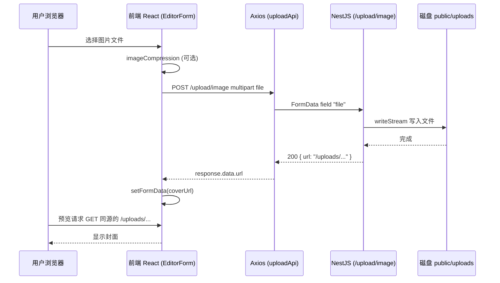
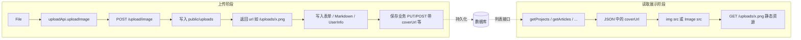
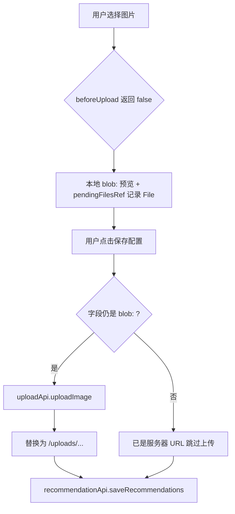

# 图片上传与读取说明

本文基于仓库当前代码，说明**前端如何调用后端上传接口**、**上传结果如何落盘**、以及**页面如何“读取”并展示图片**（注意：图片本身不是通过单独的“下载接口”拉取，而是使用后端返回的 URL 作为静态资源路径）。

---

## 1. 总览

| 环节 | 实现要点 |
|------|-----------|
| 上传 HTTP 接口 | `POST /upload/image`，`multipart/form-data`，字段名 **`file`** |
| 前端封装 | `uploadApi.uploadImage(file)`（`src/services/api.ts`） |
| 后端处理 | NestJS `UploadController` + `UploadService`，将文件写入磁盘并返回 **`{ url }`** |
| 返回的 `url` 形态 | 相对路径，例如 **`/uploads/时间戳_随机数.ext`** |
| “读取”图片 | 浏览器对 `url` 发起 **GET**（静态资源）；列表/详情里的地址来自 **业务接口 JSON**（如 `coverUrl`），不是再调上传接口 |

---

## 2. 前端：Axios 实例与上传 API

### 2.1 基础地址

`api` 使用环境变量 `VITE_API_BASE_URL`，未配置时默认为 `http://localhost:4000`：

```19:28:src/services/api.ts
const API_BASE_URL =
  import.meta.env.VITE_API_BASE_URL || 'http://localhost:4000';

const api = axios.create({
  baseURL: API_BASE_URL,
  timeout: 10000,
  headers: {
    'Content-Type': 'application/json',
  },
});
```

因此上传请求的完整 URL 一般为：  
`{API_BASE_URL}/upload/image`  
（例如 `http://localhost:4000/upload/image`。）

### 2.2 `uploadApi.uploadImage`

前端将 `File` 放入 `FormData`，键名为 **`file`**（与后端 `FileInterceptor('file')` 一致），并对该次请求覆盖 `Content-Type` 为 `multipart/form-data`：

```137:147:src/services/api.ts
export const uploadApi = {
  uploadImage: (file: File) => {
    const formData = new FormData();
    formData.append('file', file);
    return api.post<{ url: string }>('/upload/image', formData, {
      headers: {
        'Content-Type': 'multipart/form-data',
      },
    });
  },
};
```

**调用方式小结**：任意组件 `import { uploadApi } from '@/services/api'`，在拿到浏览器 `File` 后执行 `await uploadApi.uploadImage(file)`，从 `response.data.url` 取字符串写入表单状态或 Markdown。

---

## 3. 后端：路由、拦截器与落盘

### 3.1 Controller

控制器挂载在 `upload` 路径下，`POST image` 即 **`POST /upload/image`**；`@UploadedFile()` 对应表单字段 **`file`**：

```1:15:backend/src/upload/upload.controller.ts
import { Controller, Post, UploadedFile, UseInterceptors } from '@nestjs/common';
import { FileInterceptor } from '@nestjs/platform-express';
import { UploadService } from './upload.service';

@Controller('upload')
export class UploadController {
  constructor(private readonly uploadService: UploadService) {}

  @Post('image')
  @UseInterceptors(FileInterceptor('file'))
  async uploadImage(@UploadedFile() file: Express.Multer.File) {
    const url = await this.uploadService.uploadFile(file);
    return { url };
  }
}
```

### 3.2 Service：保存位置与返回 URL

- 目录：`process.cwd()` 的上一级下的 **`public/uploads`**（在常见布局中，从 `backend` 目录启动时即仓库根目录的 `public/uploads`）。
- 文件名：`Date.now()` + 随机数 + 原始扩展名。
- 返回给前端的 **`url`** 为 **`/uploads/文件名`**，供前端与浏览器直接当路径使用。

```16:35:backend/src/upload/upload.service.ts
  async uploadFile(file: Express.Multer.File): Promise<string> {
    try {
      const fileName = `${Date.now()}_${Math.round(Math.random() * 10000)}${extname(file.originalname)}`;
      const filePath = join(this.uploadDir, fileName);

      // Create write stream and save file
      const writeStream = createWriteStream(filePath);
      await new Promise<void>((resolve, reject) => {
        writeStream.write(file.buffer, (error) => {
          if (error) {
            reject(error);
          } else {
            writeStream.end();
            resolve();
          }
        });
      });

      // Return relative URL
      return `/uploads/${fileName}`;
```

### 3.3 CORS

后端在 `main.ts` 中对若干本地前端端口开启了 CORS；当前端 `baseURL` 指向 `http://localhost:4000`、页面在 `5173` 时，上传属于**跨域请求**，依赖该配置。

---

## 4. 前端在哪些页面调用上传接口

### 4.1 编辑器封面：`EditorForm.tsx`

流程：可选 `browser-image-compression` 压缩 → `uploadApi.uploadImage` → 把返回的 `url` 写入 `formData.coverUrl`。预览用 `Image` 的 `src={formData.coverUrl}`，也支持用户手动输入 URL。

```33:57:src/pages/Editor/EditorForm.tsx
  const handleImageUpload = async (file: File) => {
    try {
      setUploading(true);

      const options = {
        maxSizeMB: 1,
        maxWidthOrHeight: 1920,
        useWebWorker: true,
        initialQuality: 0.8,
        fileType: 'image/jpeg',
      };

      const compressedFile = await imageCompression(file, options);

      const response = await uploadApi.uploadImage(compressedFile);
      setFormData({ ...formData, coverUrl: response.data.url });
      message.success('图片上传成功');
    } catch (error) {
      console.error('Image upload failed:', error);
      message.error('图片上传失败，请重试');
    } finally {
      setUploading(false);
    }
    return false;
  };
```

```159:198:src/pages/Editor/EditorForm.tsx
        {formData.coverUrl && (
          <div className="cover-preview">
            <Image
              src={formData.coverUrl}
              alt="封面预览"
            />
            ...
        <Input
          placeholder="或直接输入图片 URL"
          value={formData.coverUrl}
          onChange={(e) => setFormData({ ...formData, coverUrl: e.target.value })}
        />
```

### 4.2 Markdown 正文插图：`MarkdownEditor.tsx`

压缩后上传，把 `response.data.url` 拼进 Markdown：``。

```21:47:src/pages/Editor/MarkdownEditor.tsx
  const handleImageUpload = async (file: File) => {
    try {
      setUploading(true);

      const options = {
        maxSizeMB: 1,
        maxWidthOrHeight: 1920,
        useWebWorker: true,
        initialQuality: 0.8,
        fileType: 'image/jpeg',
      };

      const compressedFile = await imageCompression(file, options);
      const response = await uploadApi.uploadImage(compressedFile);

      const imageMarkdown = `

`;
      onChange(content + imageMarkdown);
      message.success('图片插入成功');
    } catch (error) {
      ...
    } finally {
      setUploading(false);
    }
    return false;
  };
```

### 4.3 后台用户设置：`UserSettings.tsx`

这里存在**两种策略**：

1. **立即上传**（例如用户头像等字段）：`handleFileUpload` 里直接 `uploadApi.uploadImage(file)`，成功后把 `response.data.url` 写回 `userInfo` 对应字段。

```200:215:src/pages/Admin/pages/UserSettings.tsx
  const handleFileUpload = async (file: File, field: string) => {
    try {
      setUploading(true);
      const response = await uploadApi.uploadImage(file);
      if (userInfo) {
        setUserInfo({ ...userInfo, [field]: response.data.url });
        message.success('上传成功');
      }
    } catch (error) {
      console.error('Upload failed:', error);
      message.error('上传失败，请重试');
    } finally {
      setUploading(false);
    }
    return false;
  };
```

2. **推荐位图片延迟上传**：`RecommendationImageUpload` 中 `beforeUpload` 返回 `false`，先用 `URL.createObjectURL(file)` 得到 **`blob:`** 预览地址并记入 `pendingFilesRef`；用户点击「保存配置」时，`handleSaveRecommendations` 遍历条目，对仍为 `blob:` 的字段取出 `File`，再调用 `uploadApi.uploadImage`，用返回的永久 `url` 替换后再 `recommendationApi.saveRecommendations`。

```342:368:src/pages/Admin/pages/UserSettings.tsx
  const handleSaveRecommendations = async () => {
    setSaving(true);
    try {
      const nextItems: RecommendedItem[] = JSON.parse(JSON.stringify(recommendedItems)) as RecommendedItem[];
      const blobUrlsToClear: string[] = [];

      for (const item of nextItems) {
        for (const key of ['defaultImage', 'hoverImage'] as const) {
          const u = item[key];
          if (typeof u !== 'string' || !u.startsWith('blob:')) continue;
          const file = recommendationPendingFilesRef.current.get(u);
          if (!file) {
            message.error('部分图片仅在本地预览，请重新选择后再保存');
            return;
          }
          const response = await uploadApi.uploadImage(file);
          item[key] = response.data.url;
          blobUrlsToClear.push(u);
        }
      }

      const res = await recommendationApi.saveRecommendations(nextItems);
      ...
```

---

## 5. “读取”图片：数据从哪来、浏览器如何加载

### 5.1 没有单独的“读图 REST 接口”

上传接口只负责**存文件 + 返回 `url`**。之后业务数据（用户资料、文章、项目、推荐配置等）里保存的是**字符串 URL**（多为 `/uploads/...`）。列表页通过 **`projectApi` / `articleApi` / `pluginApi`** 等拉 JSON，取出 `coverUrl`（或兼容字段）赋给卡片封面，本质是普通的 **``** 或组件封装。

示例：`Products.tsx` 将接口返回的 `coverUrl` 归一成 `cover` 供 UI 使用：

```65:75:src/pages/Products/Products.tsx
        setProjects(
          (projectsRes.data || []).map((p) => {
            const cover = p.cover || p.coverUrl;
            console.log('Project cover data:', { id: p.id, title: p.title, cover, pCover: p.cover, pCoverUrl: p.coverUrl });
            return {
              ...p,
              id: String(p.id),
              description: p.description || p.summary,
              cover: cover,
            };
          }),
        );
```

### 5.2 开发环境下 `/uploads/...` 为何能打开

Vite 会把项目根目录 **`public/`** 下的文件映射到站点根路径。后端把文件写到仓库的 **`public/uploads`** 后，开发时访问 **`http://localhost:5173/uploads/xxx.png`** 即可由开发服务器提供该静态文件。

`vite.config.ts` 里还为代理预留了与上传目录相关的转发说明（接口仍主要通过 `/api` 转发规则处理；上传 URL 本身为相对路径 `/uploads/...` 时，由当前页面所在源解析，通常即前端开发服务器）：

```19:32:vite.config.ts
  server: {
    proxy: {
      // 接口：浏览器只访问 5173，由 Vite 转发到后端，避免跨端口 Cookie/CORS
      '/api': {
        target: 'http://localhost:4000',
        changeOrigin: true,
        rewrite: (path) => path.replace(/^\/api/, ''),
      },
      // 静态上传文件：与接口同源走 5173，再转发到 4000（需与后端返回的 /uploads/... 一致）
      'public/uploads': {
        target: 'http://localhost:4000',
        changeOrigin: true,
      },
    },
  },
```

**注意**：当前 Nest `main.ts` 中未见使用 `ServeStaticModule` 托管 `public/uploads`；若生产环境前后端分离且静态资源不由同一主机提供，需要自行配置 CDN/Nginx 或后端静态目录，使 **`/uploads/*`** 与保存路径一致。

---

## 6. 流程图

### 6.1 上传时序（以编辑器封面为例）



### 6.2 从上传到列表展示的数据流



### 6.3 后台推荐图：延迟上传决策



---

## 7. 小结

- **上传**：前端统一通过 `uploadApi.uploadImage` 以 **`multipart/form-data` + 字段 `file`** 调用 **`POST /upload/image`**；后端返回 **`{ url }`**，`url` 为 **`/uploads/文件名`**。
- **读取**：业务接口返回的 JSON 携带该 URL；浏览器对 **`/uploads/...`** 发 GET；本地开发时文件位于仓库 **`public/uploads`**，由 Vite 对 **`public`** 的约定提供静态访问。
- **变体**：`UserSettings` 中推荐位使用 **blob 预览 + 保存时再上传**，减少无效上传，但最终仍落回同一 `uploadApi`。

如需扩展生产环境，请重点核对 **`/uploads` 的托管方式** 与 **`VITE_API_BASE_URL`** 是否与部署域名一致。
