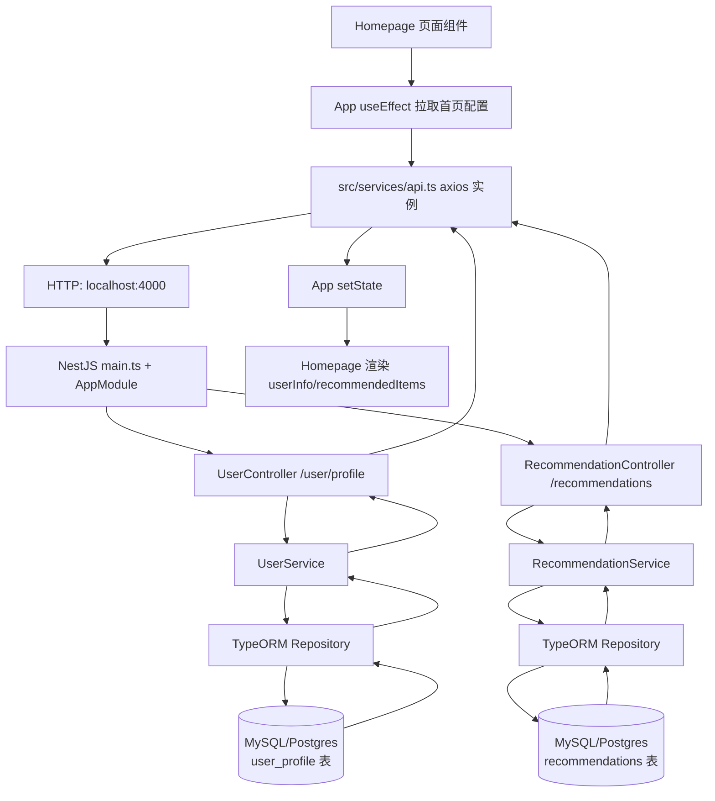
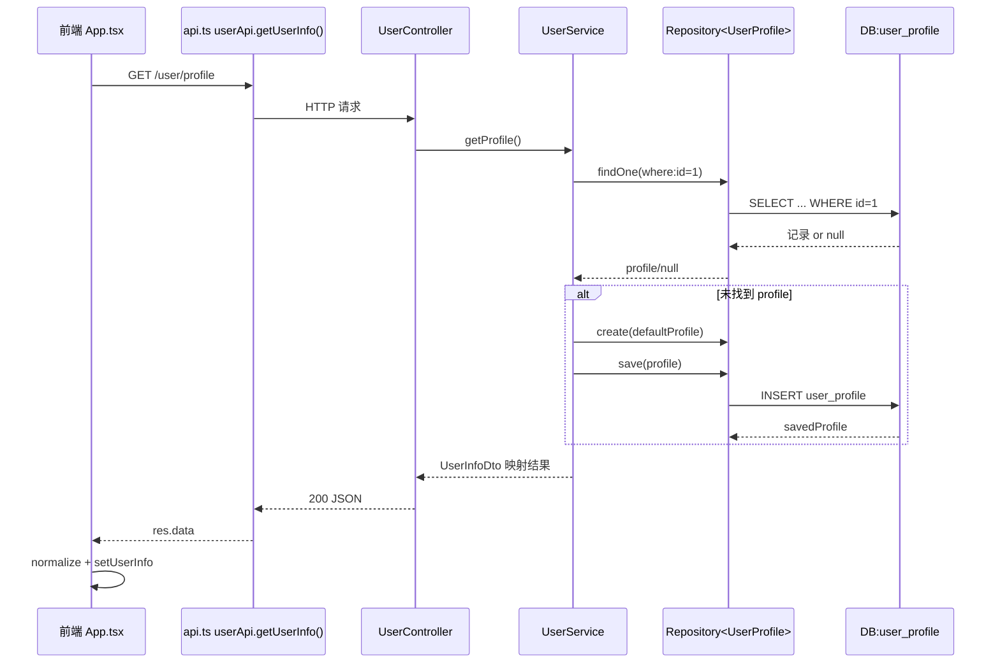
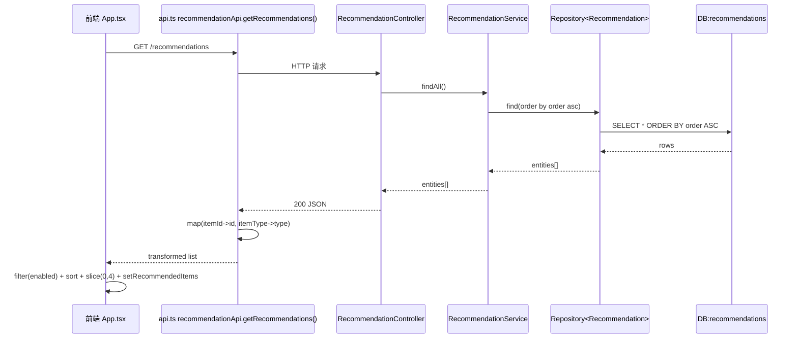
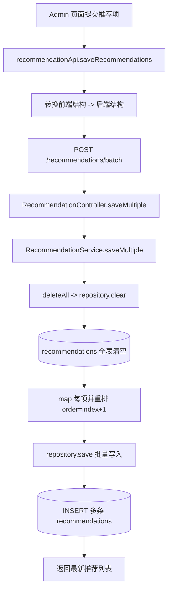

# 首页配置后端交互与数据流转（Mermaid）

本文档描述首页配置相关的端到端链路：前端 API 调用、后端 Controller/Service/ORM、数据库读写与返回。

## 1) 总体逻辑结构图

## 2) `/user/profile` 数据流（查询 + 兜底创建）

## 3) `/recommendations` 数据流（查询列表）

## 4) `/recommendations/batch` 数据流（后台批量保存）

## 5) 关键实现文件索引

- 前端调用入口：`src/App.tsx`、`src/services/api.ts`
- 后端启动与数据库连接：`backend/src/main.ts`、`backend/src/app.module.ts`
- 用户信息链路：`backend/src/user/user.controller.ts`、`backend/src/user/user.service.ts`、`backend/src/user/user-profile.entity.ts`
- 推荐项链路：`backend/src/recommendations/recommendation.controller.ts`、`backend/src/recommendations/recommendation.service.ts`、`backend/src/recommendations/recommendation.entity.ts`
