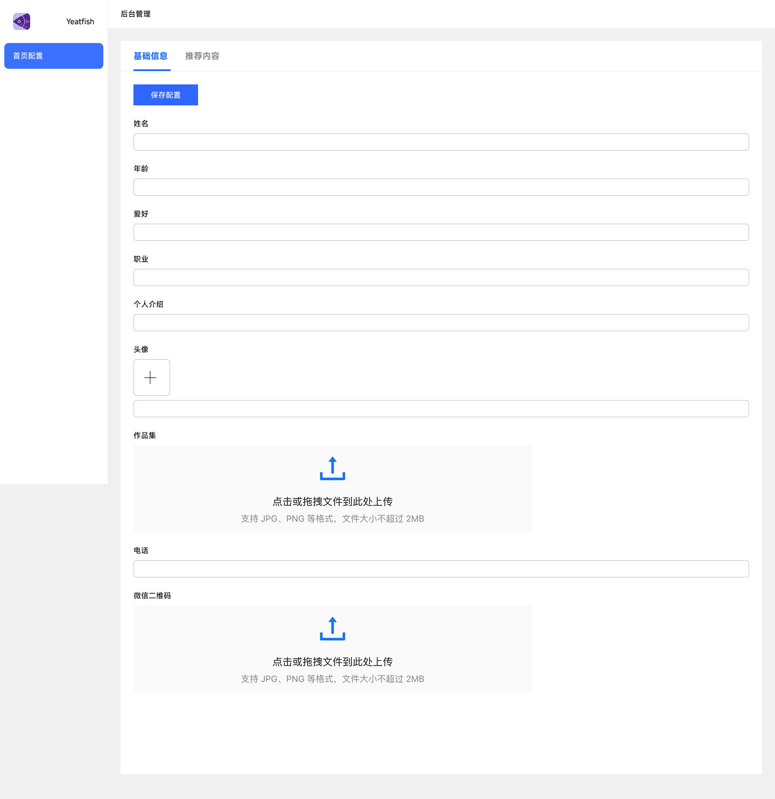
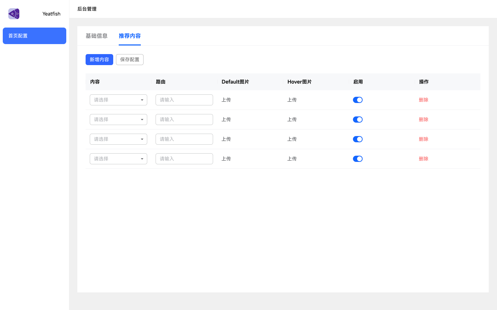

# 需求背景
用户想要对首页显示的元素进行配置，具体内容包括：
1. logo图片
2. 显示推荐项目
   1. 推荐项目从数据库中获取，内容包括项目、文章、插件等。
   2. 配置完推荐项目后，点击保存按钮，将配置保存到数据库中。用户可以在首页查看推荐项目。
   3. 支持用户为推荐项目添加default图片、hover图片。
   4. 支持推荐项目启用、禁用、删除操作。
3. 自我描述
   1. 头像
   2. 姓名
   3. 用户标签
      1. 职业
      2. 姓名
      3. 爱好
   4. 自我评价
4. 简历及作品集上传，上传后支持其他用户下载。仅支持PDF格式。大小不超过200MB。
5. 联系我
   1. 手机号
   2. 微信二维码上传，上传后支持其他用户扫描。

# 功能设计
1. 首页配置页面以tab形式展示，每个tab对应一个配置项。主要分为两个配置模块：
   1. 基础信息配置
      1. 基础信息配置包括：
         1. 姓名：0-10个字符，必填
         2. 年龄：0-3个字符，必填，只能输入数字，最大值为120
         3. 爱好：0-10个标签，每个标签0-20个字符，用逗号分隔；必填
         4. 职业：0-10个字符，必填
         5. 个人介绍：0-300个字符，必填
         6. 头像：可上传本地图片，也可以上传图片链接；必填
         7. 作品集：仅支持PDF格式，大小不超过200MB；必填
         8. 电话：0-11个字符，必填，只能输入数字，最大值为11位。需要做格式校验，确保输入的是正确的手机号。
         9. 微信二维码：可上传本地图片；必填；大小5mb以内
         10. 设计图如下：
         
   2. 推荐项目配置
      1. 推荐项目配置包括：
         1. 推荐项目：从数据库中获取，内容包括项目、文章、插件等。
         2. 选择推荐的项目，显示在首页。
         3. 支持用户为推荐项目添加default图片、hover图片。
         4. 支持推荐项目启用、禁用、删除操作。
         5. 保存配置后生效。
         6. 设计图如下：
         